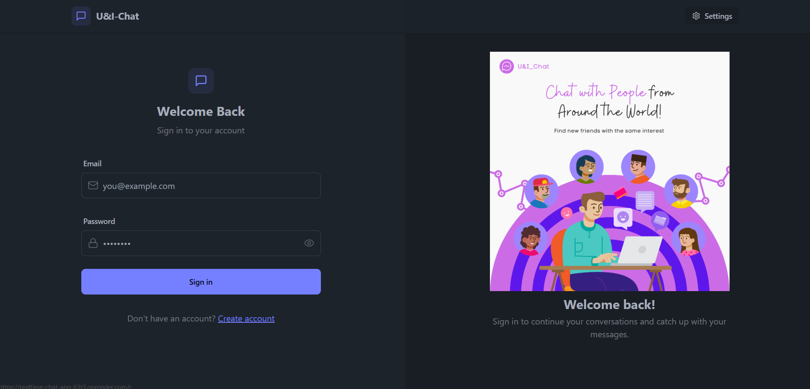
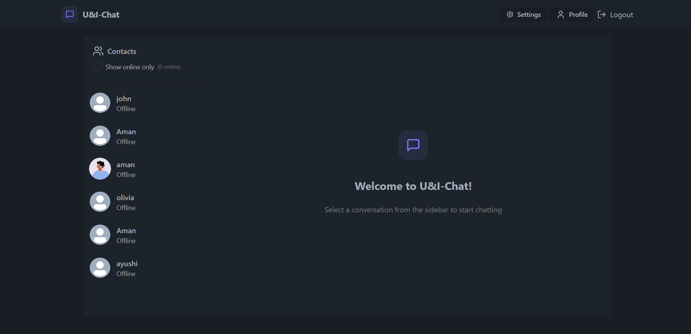
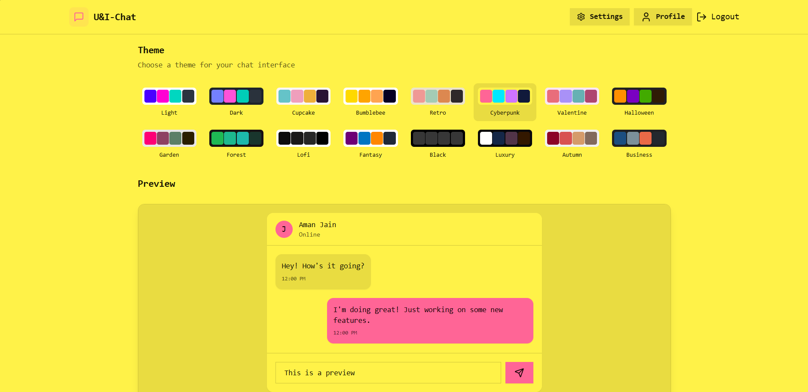
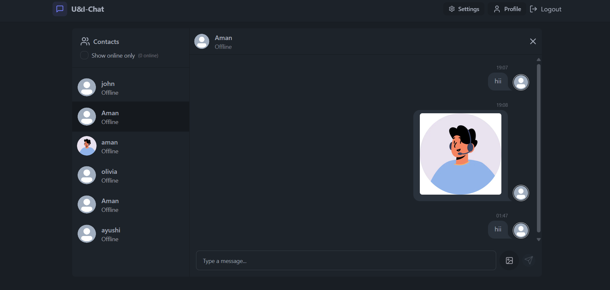

# U\&I Chat – Realtime Chat Application

[Live Demo](https://realtime-chat-app-63t3.onrender.com/login) 

## Overview

U\&I Chat is a real-time messaging application built with the MERN stack and Socket.io. It enables users to create accounts, securely log in, and chat instantly with other users. Messages are delivered with low latency, and users can share images in their chats.

## Features

* **Real-Time Messaging**: Instant message delivery with latency under 200ms using Socket.io.
* **Secure Authentication**: User sign-up and login flows, JWT-based authentication, and 100% client-side route protection.
* **Message History**: Personalized chat history stored in MongoDB for each user.
* **Image Sharing**: Upload and send images (max 50KB) within chat conversations.
* **Responsive UI**: Modern, responsive interface built with React.js.
* **Scalable Deployment**: Frontend and backend services deployed on Render, connected to MongoDB Atlas for high availability.

## 🌟 Home page

## 🌟 Chat page

## 🌟 Themes page

## 🌟 Chat and Photos upload(<50KB)



## Tech Stack

* **Frontend**: React.js, Socket.io-client, React Router
* **Backend**: Node.js, Express.js, Socket.io, JSON Web Tokens (JWT)
* **Database**: MongoDB Atlas
* **Deployment**: Render

## Getting Started

### Prerequisites

* Node.js (v14+)
* npm or yarn
* MongoDB Atlas account

### Installation

1. **Clone the repository**

   ```bash
   git clone GITHUB
   cd ui-chat
   ```

2. **Install dependencies**

   ```bash
   # Frontend
   cd frontend
   npm install

   # Backend
   cd ../backend
   npm install
   ```

3. **Configure environment variables**

   Create a `.env` file in the `backend` directory:

   ```env
   PORT=5000
   MONGO_URI=<your-mongodb-connection-string>
   JWT_SECRET=<your-jwt-secret>
   ```

4. **Run the application**

   ```bash
   # Start backend
   cd backend
   npm start

   # Start frontend
   cd ../frontend
   npm start
   ```

5. **Access the app**

   Open [http://localhost:3000](http://localhost:3000) to view the application.

## Usage

1. **Sign Up / Login**: Create a new account or log in with existing credentials.
2. **Create or Join Chat**: Select a user from the list to start a one-on-one chat.
3. **Send Messages**: Type messages or upload small images (max 50KB) to share.
4. **View History**: Scroll up to view past conversations loaded from the database.

## Deployment

This application is configured for deployment on Render.

1. **Create two services**:

   * **Frontend**: Connect the `frontend` folder, set the build command to `npm run build`, and publish the `build` directory.
   * **Backend**: Connect the `backend` folder, set the start command to `npm start`, and add environment variables for `MONGO_URI` and `JWT_SECRET`.

2. **Connect MongoDB Atlas**:

   * Set your `MONGO_URI` in the Render dashboards for both services as needed.

3. **Enable CORS** in the backend to allow requests from your frontend domain.

## Contributing

Contributions are welcome! Please open an issue or submit a pull request for enhancements and bug fixes.

## License

This project is licensed under the MIT License. See the [LICENSE](LICENSE) file for details.
